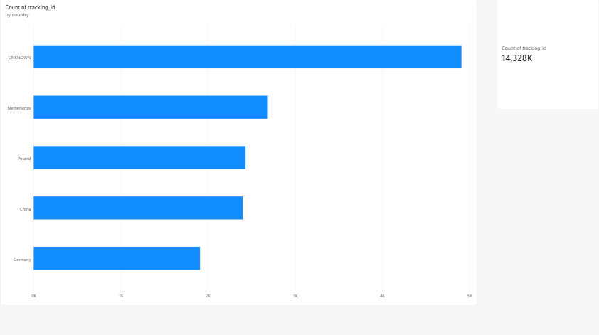

# 📦 Supply Chain ETL Pipeline & Data Cleaning

## 📌 Project Overview
This project is an automated end-to-end **ETL (Extract, Transform, Load)** pipeline built with Python, Pandas, and SQLite. It simulates a real-world logistics environment where warehouse data is often messy, missing, or improperly formatted. 

The pipeline ingests raw logistics data, cleans it, applies business logic to flag critical errors, and exports a production-ready report for supply chain managers.

## 🛠️ Tech Stack
* **Language:** Python 3
* **Database:** SQLite3
* **Data Processing:** Pandas, NumPy
* **Version Control:** Git & GitHub

## ⚙️ Pipeline Architecture

### 1. Extract (SQL)
* Connects to a relational database containing multiple tables (`global_shipments`, `suppliers`).
* Executes a `LEFT JOIN` SQL query to merge shipment data with supplier information, intentionally preserving orphaned freight (shipments with missing supplier IDs).

### 2. Transform (Pandas)
* **Data Cleaning:** Removes duplicate barcode scans.
* **Type Conversion:** Standardizes broken date strings (e.g., "PENDING_SYSTEM_ERROR") into proper `NaT` (Not a Time) datetime objects using `errors='coerce'`.
* **Null Handling:** Fills missing `weight_kg` values with `0.0` and missing suppliers with `"UNKNOWN"`.
* **Feature Engineering:** Uses vectorized logic (`np.where`) to automatically flag "Critical Shipments" that require manual review on the warehouse floor.

### 3. Load (CSV Export)
* Filters the dataset to isolate only critical errors.
* Automatically exports a `critical_shipments_audit.csv` report formatted perfectly for German Excel regional settings (semicolon separators).

## 🚀 Big Data Stress Test
The system includes a data generation script capable of building a **100,000-row SQLite database** in seconds. The ETL pipeline successfully processes, cleans, and filters all 100,000 records in under 3 seconds, proving high efficiency over traditional manual spreadsheet methods.

## 📊 Power BI Executive Dashboard
